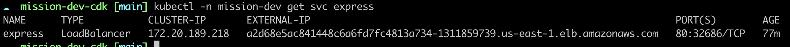

# Build and push docker image to dockerhub
```
docker build -t freemanpolys/mission-dev .
docker push freemanpolys/mission-dev

```

# Deploy the express app in eks with loadbalancer service
Kubernetes resources is in deploy folder. The application is deployed using a deployment resource and is expose via Loadbalancer service.

```
cd deploy
kubectl apply -f .
```
# Get the app url
```
kubectl -n mission-dev get svc express
```


The app url is shown in the EXTERNAL-IP field : http://a2d68e5ac841448c6a6fd7fc4813a734-1311859739.us-east-1.elb.amazonaws.com

